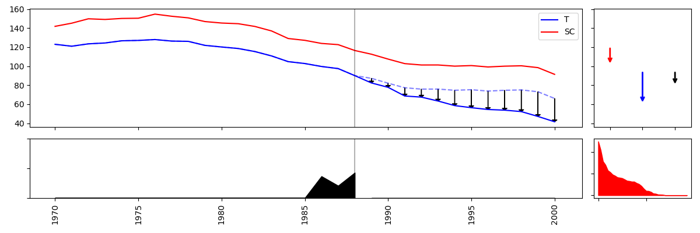

azcausal: Causal Inference in Python
====================================================================

Causal inference is an important component of the experiment evaluation. We highly recommend to have a look at the open-source
book: `Causal Inference for The Brave and True <https://matheusfacure.github.io/python-causality-handbook/landing-page.html>`_

Currently, azcausal provides two well-known and widely used causal inference methods: Difference-in-Difference (DID) and
Synthetic Difference-in-Difference (SDID). Moreover, error estimates via Placebo, Boostrap, or JackKnife are available.

.. _Installation:

Installation
********************************************************************************

To install the current release, please execute:

.. code:: bash

    pip install git+https://github.com/amazon-science/azcausal.git

.. _Usage:

Usage
********************************************************************************

.. code:: python

    import numpy as np

    from azcausal.core.error import Placebo
    from azcausal.core.panel import Panel
    from azcausal.core.parallelize import Pool
    from azcausal.data import CaliforniaProp99
    from azcausal.estimators.panel.sdid import SDID
    from azcausal.util import to_matrices

    # load an example data set with the columns Year, State, PacksPerCapita, treated.
    df = CaliforniaProp99().load()

    # convert to matrices where the index represents each Year (time) and each column a state (unit)
    outcome, intervention = to_matrices(df, "Year", "State", "PacksPerCapita", "treated")

    # if there are nan values it was not balanced in the first place.
    assert np.isnan(outcome.values).sum() == 0, "The panel is not balanced."

    # create a panel object to access observations conveniently
    panel = Panel(outcome, intervention)

    # initialize an estimator object, here synthetic difference in difference (sdid)
    estimator = SDID()

    # run the estimator
    result = estimator.fit(panel)

    # create a process pool for parallelization
    pool = Pool(mode="thread", progress=True)

    # run the error validation method
    method = Placebo(n_samples=11)
    estimator.error(result, method, parallelize=pool)

    # print out information about the estimate
    print(result.summary(title="CaliforniaProp99"))

.. _Estimators:

Estimators
********************************************************************************

- **Difference-in-Difference (DID):** Simple implementation of the well-known Difference-in-Difference estimator.
- **Synthetic Difference-in-Difference (SDID):** Arkhangelsky, Dmitry Athey, Susan Hirshberg, David A. Imbens, Guido W. Wager, Stefan Synthetic Difference-in-Differences American Economic Review 111 12 4088-4118 2021 10.1257/aer.20190159 https://www.aeaweb.org/articles?id=10.1257/aer.20190159. Implementation based on https://synth-inference.github.io/synthdid/

.. _Contact:

Contact
********************************************************************************

Feel free to contact me if you have any questions:

| `Julian Blank <http://julianblank.com>`_  (blankjul [at] amazon.com)
| Amazon.com
| Applied Scientist, Amazon
| 410 Terry Ave N, Seattle 98109, WA.

